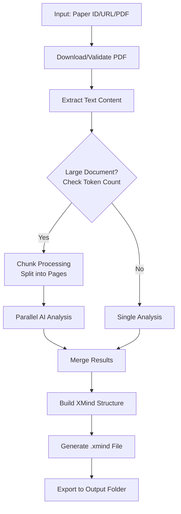

<div align="center">

# 🧠 ArXiv Paper to XMind Converter

[](https://www.python.org/)
[](LICENSE)
[](https://openai.com/)

### Transform Academic Papers into Visual Mind Maps 📚 → 🧩

**Automatically convert ArXiv papers to structured XMind mind maps for rapid comprehension**

</div>

## ✨ Features

| Feature | Status | Description |
|---------|--------|-------------|
| 🌐 Multi-input Support | ✅ | ArXiv URL, ID, and local PDF files |
| 🤖 AI-Powered Analysis | ✅ | OpenAI API intelligent content parsing |
| 📊 Hierarchical Mapping | ✅ | Auto-generated structured mind maps |
| 🔁 Chunk Processing | ✅ | Handles large documents (>16K tokens) |
| 📝 Detailed Descriptions | ✅ | Preserves paper's comprehensive info |
| 🎯 Structure Optimization | ✅ | Optimized depth and node relationships |
| 🚀 Batch Processing | ✅ | Process multiple papers at once |

## 🏗️ Project Architecture

```
paper2xmind/
├── 📁 core/                    # Core modules
│   ├── arxiv_downloader.py    # 📥 ArXiv papers download & processing
│   ├── pdf_extractor.py       # 📄 PDF text extraction & chunking
│   ├── content_analyzer.py    # 🧠 AI-powered content analysis
│   ├── structure_builder.py   # 🏗️  XMind structure construction
│   └── xmind_generator.py     # 💾 Final XMind file generation
├── 📁 utils/                   # Utility functions
│   ├── config.py             # ⚙️  Configuration management
│   └── utils.py              # 🔧 Helper functions
├── 📁 tests/                   # 🧪 Unit & integration tests
│   ├── test_components.py    # 🔍 Component-level tests
│   └── test_end_to_end.py    # 🔄 End-to-end tests
├── 📄 main.py                 # 🚀 Entry point
├── 📦 requirements.txt        # 📚 Dependencies
├── 📁 data/                   # 📂 Input data storage
├── 📁 output/                 # 📤 Generated mind maps
└── 📁 xmind_base/            # 🎨 XMind template files
```

## 🚀 Quick Start

### Prerequisites

- Python 3.8+
- OpenAI API Key
- Internet connection

### Installation

```bash
# 1. Clone the repository
git clone https://github.com/1998x-stack/paper2xmind.git
cd paper2xmind

# 2. Install dependencies
pip install -r requirements.txt

# 3. Set up environment variables
cp .env.example .env
# Edit .env with your OpenAI API key
```

### Configuration

Create a `.env` file with your OpenAI credentials:

```env
OPENAI_API_KEY=your_openai_api_key_here
OPENAI_MODEL=gpt-4o
OPENAI_BASE_URL=https://api.openai.com/v1
```

### Basic Usage

```bash
# 🎯 Convert using ArXiv ID
python main.py 2301.12345

# 🌐 Convert using ArXiv URL
python main.py https://arxiv.org/abs/2301.12345

# 📄 Convert local PDF
python main.py ./path/to/paper.pdf

# 📝 Specify output filename
python main.py 2301.12345 -o "my_research_map.xmind"

# 📦 Batch processing
python main.py --batch papers_list.txt
```

### Interactive Mode

```bash
# Launch interactive mode
python main.py
```

## 🔄 Processing Pipeline



## 🧪 Testing

Run the test suite:

```bash
# Run all tests
python -m pytest tests/

# Run component tests
python test_components.py

# Run with coverage
python -m pytest --cov=. tests/
```

## 🎯 Output Structure

Generated mind maps follow this logical hierarchy:

```
🔬 Research Paper Title
├── 📄 Abstract
│   └── 📝 Key contributions & findings
├── 📋 Introduction
│   ├── 📚 Background & context
│   ├── ❓ Problem statement
│   └── ✨ Novel contributions
├── 📖 Related Work
│   ├── 🏗️ Previous approaches
│   └── 🚫 Existing limitations
├── ⚙️ Methodology
│   ├── 🏗️ Model architecture
│   ├── 🔄 Training strategy
│   └── ⚙️ Implementation details
├── 🧪 Experiments
│   ├── 📊 Datasets
│   ├── 📐 Baselines
│   └── 📈 Evaluation metrics
├── 📊 Results
│   ├── 🏆 Main results
│   ├── 🔬 Ablation studies
│   └── 📊 Performance analysis
└── 📝 Conclusion
    ├── 📋 Summary
    └── 🔮 Future work
```

## ⚙️ Configuration Options

| Variable | Default | Description |
|----------|---------|-------------|
| `OPENAI_API_KEY` | `""` | Your OpenAI API key |
| `OPENAI_MODEL` | `"gpt-4o"` | Model to use for analysis |
| `MAX_TOKENS_PER_REQUEST` | `16384` | Max tokens per API call |
| `PAGES_PER_CHUNK` | `3` | Pages per processing chunk |
| `OUTPUT_DIR` | `"./output"` | Output directory path |

## 🛠️ Development

### Running Tests

```bash
# Install development dependencies
pip install -r requirements-dev.txt

# Run unit tests
python -m pytest tests/unit/

# Run integration tests
python -m pytest tests/integration/

# Run all tests with coverage
python -m pytest --cov=paper2xmind --cov-report=html
```

### Code Quality

```bash
# Lint the code
flake8 .

# Format code
black .

# Type checking
mypy .
```

## 🤝 Contributing

We welcome contributions! Here's how you can help:

1. 🍴 Fork the repository
2. 🌟 Create a feature branch (`git checkout -b feature/amazing-feature`)
3. 📝 Commit your changes (`git commit -m 'Add amazing feature'`)
4. 🚀 Push to the branch (`git push origin feature/amazing-feature`)
5. 🔄 Open a Pull Request

### Development Guidelines

- Write clear, descriptive commit messages
- Include tests for new features
- Follow PEP 8 coding standards
- Document public APIs with docstrings

## 📝 License

This project is licensed under the MIT License - see the [LICENSE](LICENSE) file for details.

## 📞 Support

- 🐛 Issues: [GitHub Issues](https://github.com/1998x-stack/paper2xmind/issues)
- 🌟 Star: Show your support by starring the repository
- 📧 Contact: [Your Email] for questions

---

<div align="center">

**Made with ❤️ for researchers and students worldwide**

⭐ Star this repository if it helped you!

</div>